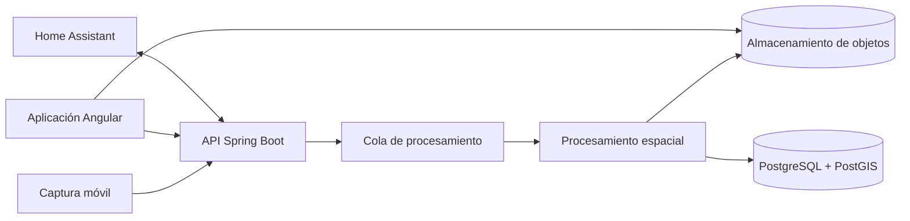

# AR Home — Arquitectura espacial

## Objetivo

AR Home es una plataforma de inventario espacial para viviendas, almacenes y comercios. Permite capturar un recorrido interior, reconstruir el espacio, identificar muebles y vincular objetos de inventario a entidades espaciales persistentes.

## Contexto del sistema

## Módulos

- `frontend`: Angular para proyectos, planos 2D, navegación 3D e inventario.
- `backend`: API Java 21 / Spring Boot y modelo de dominio.
- `capture-mobile`: Capacitor más adaptadores nativos ARCore y RoomPlan/ARKit.
- `spatial-processing`: trabajos Python/C++ para keyframes, optimización, reconstrucción y reconocimiento.
- `contracts`: contratos versionados de captura, eventos y API.
- `infrastructure`: servicios Docker y recursos de despliegue.
- `ha-panel`: panel de Home Assistant.
- `home-assistant-addon`: empaquetado para Home Assistant.

## Dominio principal

- Site
- Building
- Floor
- Room
- CaptureSession
- CameraPose
- RouteNode
- RouteEdge
- SpatialAnchor
- FurnitureInstance
- Container
- InventoryItem
- Observation

## Pipeline de captura

1. Crear una sesión de captura.
2. Registrar fotogramas RGB, profundidad cuando exista, IMU y poses de cámara.
3. Seleccionar keyframes y detectar degradación del tracking.
4. Optimizar el grafo de poses y cerrar bucles.
5. Reconstruir nube de puntos y malla.
6. Extraer suelo, paredes, puertas y habitaciones para el plano 2D.
7. Detectar muebles y fusionar observaciones en 3D.
8. Crear identidades persistentes y anclajes espaciales.
9. Construir nodos del recorrido virtual.
10. Validar manualmente antes de publicar el escaneo.

## Estrategia de representación

El sistema mantiene tres representaciones sincronizadas:

- recorrido fotográfico para navegación visual fiable;
- modelo 2D semántico para edición, búsqueda y rutas;
- modelo 3D GLB para visualización y selección espacial.

## Decisiones iniciales

- Angular y Three.js para la experiencia web.
- Spring Boot como monolito modular inicial.
- PostgreSQL/PostGIS para datos transaccionales y geométricos.
- almacenamiento compatible con S3 para imágenes, profundidad, nubes y GLB.
- workers Python con OpenCV, Open3D y PyTorch.
- Capacitor con plugins nativos; WebXR queda como modo básico.
- procesamiento asíncrono mediante RabbitMQ en la primera versión.
